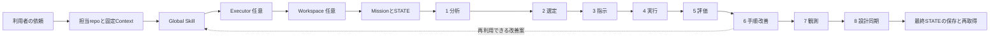

# 作業と改善の流れ

```mermaid
flowchart LR
  U[利用者の依頼] --> C[担当repoと固定Context]
  C --> G[Global Skill]
  G --> E[Executor 任意]
  E --> W[Workspace 任意]
  W --> M[MissionとSTATE]
  M --> S1[1 分析]
  S1 --> S2[2 選定] --> S3[3 指示] --> S4[4 実行]
  S4 --> S5[5 評価] --> S6[6 手順改善] --> S7[7 観測] --> S8[8 設計同期]
  S8 --> R[最終STATEの保存と再取得]
  S6 -. 再利用できる改善案 .-> G
```

外側の作業工程は、事前構築 → 本構築 → 独立確認 → 公開判断です。8工程の1周を完了しても、外側の全工程が完了したことにはなりません。各矢印は担当と権限が確認された場合の受渡しを表し、自動配送や自動公開を意味しません。
